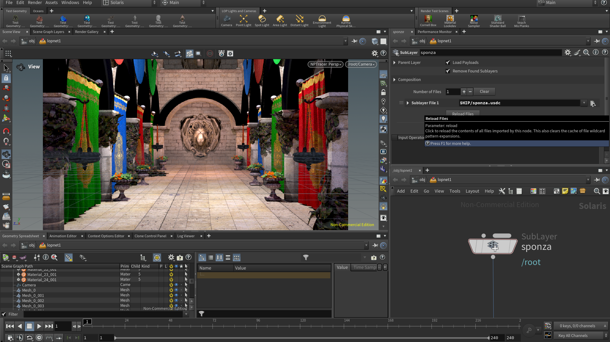
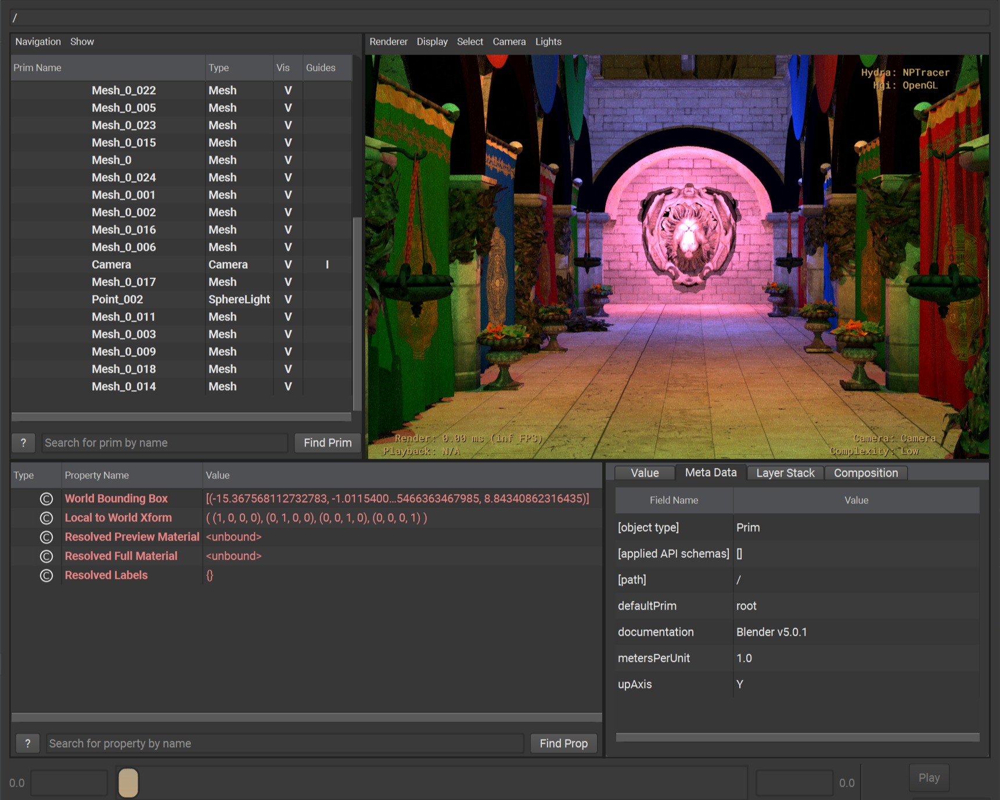

# NPTracer - **_Non-Photorealistic Pathtracing_** in Houdini



## Build Instructions

NPTracer has a build pipeline setup through CMake.

### Environment variables

These variables must be set as system-wide environment variables, as they will be used internally by Houdini at start-up.

However, after they are set as environment variables, they will be automatically extracted in CMake. i.e. no more manual configuration is needed for them.

#### `CUSTOM_DSO_PATH`

Set this variable to any directory you want the built `.dso` plugin to be installed into.

For example: `E:\HoudiniDevelopment\21`

#### `HOUDINI_DSO_PATH`

This is the variable that Houdini uses to locate plugins.

You should add `CUSTOM_DSO_PATH` to it.

- On Windows, it would look something like this: `%CUSTOM_DSO_PATH%;&`.
- On MacOS and Linux (Bash-based shells), it would look something like this: `$CUSTOM_DSO_PATH%;&`

#### `CUSTOM_USD_DSO_PATH`

- This variable is the directory that Houdini will look for `plugInfo.json`, which is how the NPTracer Hydra Renderer Plugin will be registered with the USD ecosystem. This process is automated through CMake, so long as the correct environment variables are set.

The standard location of `CUSTOM_USD_DSO_PATH` is: `<CUSTOM_DSO_PATH>/usdPlugins`

#### `HOUDINI_USD_DSO_PATH`

This holds the same principles as `HOUDINI_DSO_PATH`.

- On Windows, it would look something like this: `%CUSTOM_USD_DSO_PATH%;&`.
- On MacOS and Linux (Bash-based shells), it would look something like this: `$CUSTOM_USD_DSO_PATH%;&`

If you are curious, Houdini has custom behavior to parse the `&` and add the value to the existing environment variable value, if set. It is not platform-specific, rather Houdini-specific.

### Other Variables

#### `HOUDINI_INSTALL_PATH`

This variable can either be set as another environment variable or through a CMake mechanism.

There are many ways to set variables through CMake. For example:

```shell
# 1. from command-line at configuration time
cmake -B path/to/project/build/directory -S path/to/project/source/directory/containing/CMakeLists.txt -DHOUDINI_INSTALL_PATH="path/to/houdini/install/path"

# 2. setting as a cache variable within a configuration file, i.e. `CMakePresets.json`
# 3. within an IDE's interface
# 4. through `cmake-gui`
```

This variable will be cached in CMake so it does not have to be set on every build. It _does_ have to be set again after an action such as deleting your build folder.


